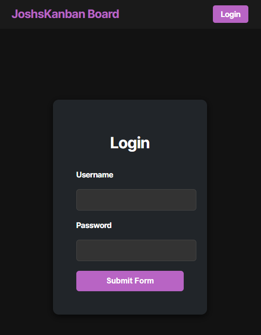
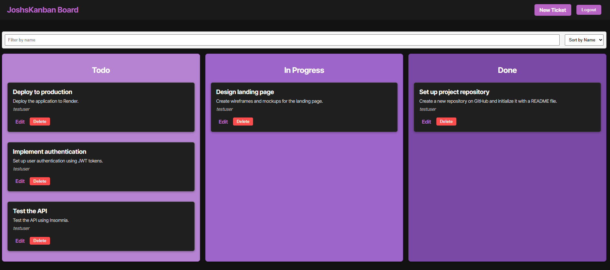

# JoshsKanban

## Overview

**JoshsKanban** is a fully functional Kanban board application built as part of a full-stack React development project. This app allows users to manage tasks across various statuses (columns), and includes secure user authentication using **JSON Web Tokens (JWT)** to ensure only authorized users can manage their boards.

This repo reflects my personal implementation, focusing on improving authentication flow, UI, and backend security while following modern development practices with TypeScript and PostgreSQL.

---

## Features

**User Authentication with JWT**:
- Secure login and token-based session management.
- Tokens stored securely in client-side `localStorage`.
- Full authentication middleware to protect routes.

**Task Management via Kanban Board**:
 - Add, edit, move, and delete tasks between columns.
 - Organized into customizable columns (e.g., To Do, In Progress, Done).

**Responsive React UI**:
 - Clean and user-friendly task board interface.
 - Protected routes redirect unauthenticated users to login.

**Backend API with TypeScript & Express**:
 - Modular, secure API endpoints for tasks and user authentication.
 - JWT-protected routes for task CRUD operations.
 - PostgreSQL integration for persistent data storage.

**Session Management**:
  - Token expiration handling for security.
  - Automatic logout and redirection when session expires.

---

## My Contributions & Focus Areas

- 🔒 Built and integrated full JWT authentication (both backend and frontend).
- 🛡️ Developed middleware to protect API routes and ensure token validation.
- 🎨 Customized login and task board UI for better UX.
- 🗄️ Connected and tested PostgreSQL database for persistent task management.
- ⚙️ Configured environment variables for secure key storage.
- 🚀 Set up project structure following scalable best practices for React and Express apps.

---

## Setup & Installation

1. **Clone the repo**:
```bash
git clone https://github.com/joshsdesk/JoshsKanban.git
cd JoshsKanban
```

2. **Install dependencies**:

- Server:
```bash
cd server
npm install
```

- Client:
```bash
cd ../client
npm install
```

3. **Set up environment variables**:

In `/server/.env`:
```
DB_USER=your_postgres_username
DB_PASSWORD=your_postgres_password
JWT_SECRET=your_secret_key
```

4. **Run both client and server**:

- Server (API backend):
```bash
npm run dev
```

- Client (React frontend):
```bash
npm run dev
```

---

## Technologies Used

- **React** with **TypeScript** (Frontend)
- **Node.js** & **Express.js** (Backend)
- **JWT (JSON Web Token)** for Auth
- **PostgreSQL** (Database)
- **Axios** for API requests
- **Tailwind CSS** *(optional if styled)* for responsive design
- **Render** (Deployment platform)

---

## Future Improvements

- 🔍 Add task filtering and sorting features.
- 📊 Dashboard for analytics on task progress.
- ✅ Add drag-and-drop for tasks between columns.
- 🔔 Add user notifications for task updates.

---

## Screenshots




---

## Deployment

  
[Live App on Render](https://joshskanban.onrender.com)

[Github Repo](https://github.com/joshsdesk/JoshsKanban)

---

## License

MIT © 
